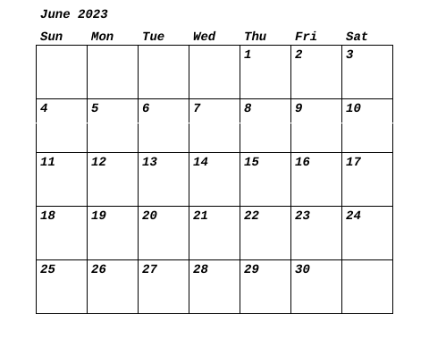

# Calendar Image Generator

This command-line tool generates a calendar image for a given month and year. By default, it generates a calendar for the current month and year if no arguments are provided.

## Usage

To build and run the tool, execute the following command:

```bash
go build -o calendar
```

This will create an executable named `calendar`.

### Generating Calendar Image

To generate a calendar image for the current month and year, run:

```bash
./calendar_generator
```

To generate a calendar image for a specific month and year, pass the `-month` and `-year` flags:

```bash
./calendar -month 5 -year 2023
```

This will create a calendar image for May 2023.

## Flags

The following flags are available:

- `-month`: The month for which the calendar should be generated (1-12). Defaults to the current month.
- `-year`: The year for which the calendar should be generated (e.g., 2023). Defaults to the current year.

## Output

The tool generates a PNG image named `calendar.png` in the same directory. This image contains the calendar grid for the specified month and year, with labels for the days of the week, the month, and the year.


