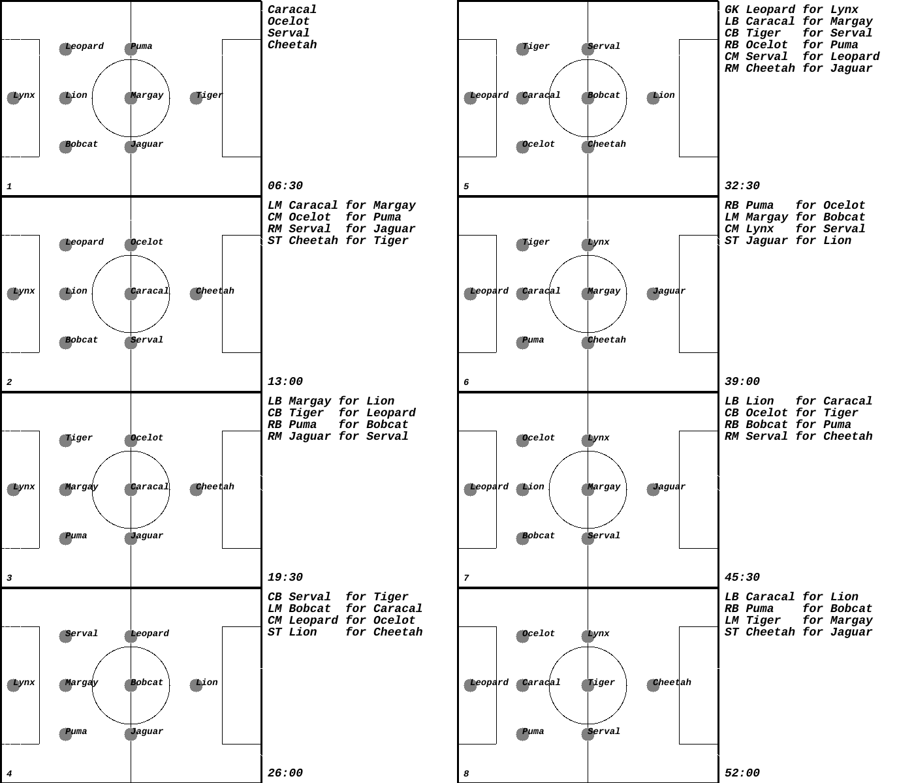

# Soccer Sub Schedule Application

I wanted to keep track of the my kids' soccer team sub schedule so I could
ensure everyone gets an equal amount of playing time at various positions.
I found it hard to visualize while at the field. This little app prints out
a visualization of the subs schedule from a csv. Usually something happens and
you have to tear it up, but it's nice to not need a phone to manage a game.

It only supports the two formations I care about for an 8-kid line-up.

## Features

- Generate a visual representation of the soccer field with player positions
- Display the changes in player positions based on the team's formation
- Customize the game length and formation with command line flags
- Output the soccer field images to a file

## Usage

To use the Soccer Sub Schedule Application:

```bash
git clone https://github.com/bballant/modir.git
cd modir
go build -o cheetah github.com/bballant/cmd/cheetah
./cheetah -t 52 -f 331 < input.csv
```

### Command Line Flags

- `-t`: The length of time in minutes for the game. Default is 52.
- `-f`: The formation of the game. Currently supported formations are 322 and 331. Default is 322.

### Input Format

The input file should be in CSV format. The first row should contain the position names (e.g., GK, LB, CB, etc.), and subsequent rows should contain the players occupying those positions at different points in time.

Example:

```
GK,LB,CB,RB,LM,CM,RM,ST
Puma,Tiger,Cougar,Leopard,Jaguar,Lynx,Snowleopard,Cheetah
Puma,Lion,Cougar,Leopard,Jaguar,Lynx,Bobcat,Cheetah
...
```

### Output

The application generates a PNG image named `soccer_fields.png` containing the soccer field diagrams with player positions and substitutions. The diagrams are arranged in two vertical columns, with a maximum of 8 diagrams (4 per column).



## License

This project is licensed under the [MIT License](LICENSE).
